# Evo_Analysis

## What is Evolutionary Medicine?

A central question in evolutionary medicine is "why are disease risk genetic variants still around?"

This paper on the evolution of cancer is a great read for those new to the topic: <https://onlinelibrary.wiley.com/doi/full/10.1111/eva.12034>

My favorite line from the paper is "*It is disturbing to recognize that natural selection does not shape organisms directly for health or longevity.*"

The manuscript also breaks down the reasons for disease vulnerability into 5 theories

1.  Mismatch with the modern environment

2.  Co-evolution with pathogens

3.  Constraints on selection

4.  Trade-offs

5.  Reproduction at the cost of health

6.  Evolved capacities for defense and their costs

For a deeper look at the evolution of disease traits see our review: <https://www.nature.com/articles/s41576-020-00305-9>

## Evolution in the genome

One way we can try to understand the evolutionary processes that have shaped traits is to look for imprints in the genome left behind by selection.

Our group has developed a pipeline that will characterize enrichment or depletion of metrics that have been computed to identify regions of the genome that have been impacted by

-   Negative Selection (Substitution rate, sequence conservation)

-   Positive Selection (Substitution rate, sequence conservation, haplotype structure)

-   Balancing Selection (Balanced polymorphisms)

-   Local Adaptation (Population differentiation)

This analysis will identify regions of the genome (composed of 1 to may SNPs) that have signatures consistent with these evolutionary forces.

While this analysis is helpful, we may want to know more about these regions. We can then build a theory (or evolutionary story) about *why* this signature exists in this region.

This is not an exhaustive list of potential questions to answer! This will hopefully lead you to more analyses.

## Evolutionary Checklist

First I'll give an overview of the questions I go through when investigating the evolutionary history of a region (or even a gene). Then I will go into detail about what resources I use to answer these questions.

1.  If we are analyzing a region identified in a GWAS, which alleles (or haplotype) are the **risk** alleles?

2.  What is known about the **consequence** of the variation in the region of interest?

3.  Are the variants associated with any changes in **gene expression**?

4.  Are the variants associated with any other traits or disorders?

5.  How deeply is the region conserved or not conserved?

6.  Do human populations vary in this region?

7.  Do associated genes have any known functions?

## Example Region

To illustrate these analyses I will provide an example analysis. I recently conducted an evolutionary analysis for a GWAS conducted on preterm birth and gestational age. (<https://www.nature.com/articles/s41588-023-01343-9>)

One of the leading SNPs is rs7650602

***NOTE on RS numbers**:* each variant in the human genome is assigned an "rs" number. This number will reference the same position in the human genome regardless of the version of the genome. Be sure to double and triple check which version of the genome you are using if you are identifying a SNP by the chromosome and position.

### 1. Risk allele

There is no standardized way to report which SNP allele increases or decreases disease risk. You will likely need to go into the reporting to identify the risk allele.

***Example:*** The GWAS used in this analysis reported the summary statistics as below:

|       |              |       |       |               |            |            |             |            |              |
|--------|--------|--------|--------|--------|--------|--------|--------|--------|--------|
| CHR   | POS          | EFF   | REF   | RSID          | SAMPLESIZE | EAF        | BETA        | SE         | pvalue       |
| **3** | **1.41E+08** | **T** | **C** | **rs7650602** | **192643** | **0.5233** | **-0.3122** | **0.0447** | **3.01E-12** |
| 3     | 1.41E+08     | T     | G     | rs145418929   | 171646     | 0.9736     | -0.2752     | 0.2375     | 0.2467       |
| 3     | 1.41E+08     | C     | A     | rs115605995   | 172653     | 0.9614     | 0.142       | 0.1156     | 0.2192       |

From this you can see they report an effect (EFF) and reference (REF) allele. To understand the effect the alleles have on the trait (risk of preterm birth/PTB) we need to look at the beta value

The beta value reports the per unit increase or decrease in the outcome. So for our SNP the beta value is -0.3122. Therefore there is a **decrease** in the *days of gestation* for the effect allele (T)

Effect Allele = T = decrease days= risk allele

Reference Allele = C = increased days = protective allele

## 2. Known variant consequences?

Many SNPs in the human genome have confirmed or hypothesized functions. There are several resources we can turn to to find these confirmed or known consequences.

**NIH dbSNP** <https://www.ncbi.nlm.nih.gov/snp/>

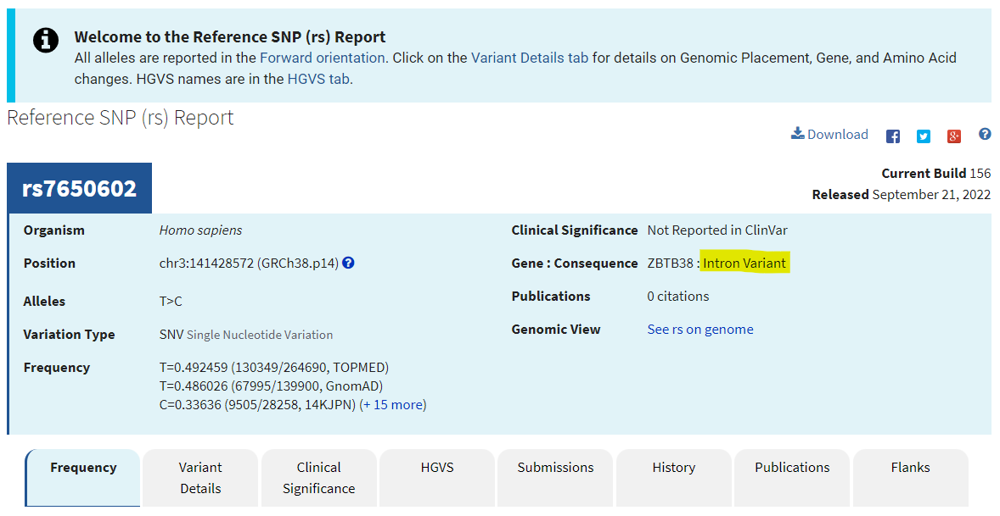{width="516"}

In dbSNP we can see that this variant rs7650602 is in the **intron of the gene ZBTB38**

**Ensembl** snp data ( <https://useast.ensembl.org/index.html> )

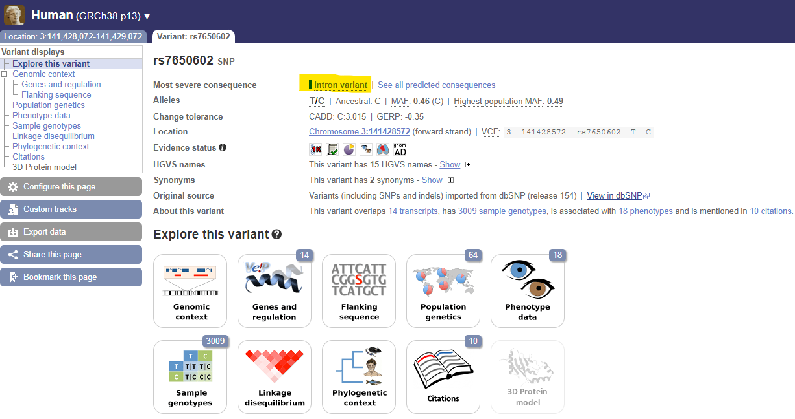{width="444"}

The Ensembl data agrees with the data in the dbSNP. You can also see there is a link to "See all predicted consequences". This link will take you to see all the predicted consequences if there is more than one.

## 3. Expression Consequences

Many common variants in the human genome have a regulatory function. If we were to find variants that result in non-synonymous changes (aka change amino acid sequences) we would turn to predictions of protein structure. These variants, however, often have severe consequences and are more likely to result in Mendelian disorders.

Determining the regulatory function of a region in the human genome is challenging! But there are several databases that can help us understand which genes may be affected by variation at our SNP.

## **RegulomeDB** (<https://regulomedb.org/> )

RegulomeDB has *a lot* of information. You can find information about the various sections here (<https://regulomedb.org/regulome-help/#FAQ>)

Let's walk through it.

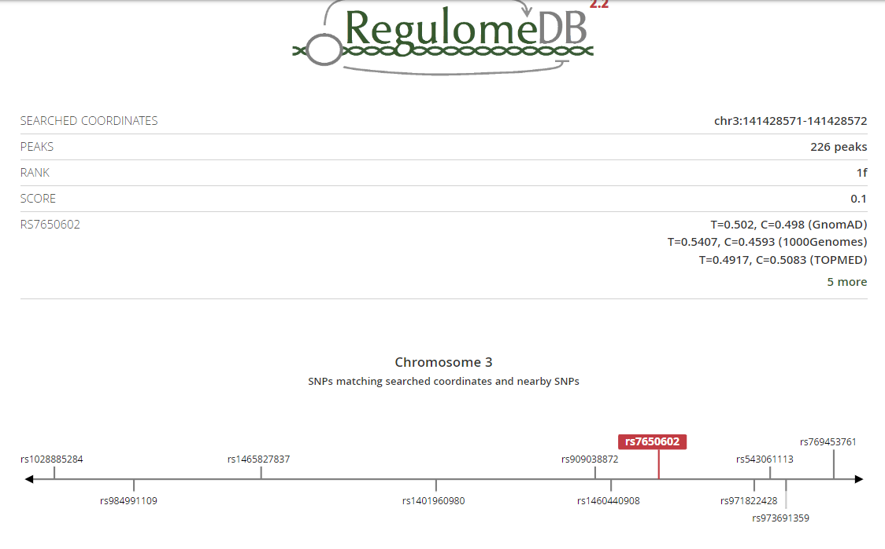{width="456"}

First you will see the coordinates of the genome (in HG38 if you used the default). In this section the most important thing to look at is the **rank**

The ranks range from 1 (most evidence) to 7 (least evidence) for data indicating that this variant is found in a regulatory region.

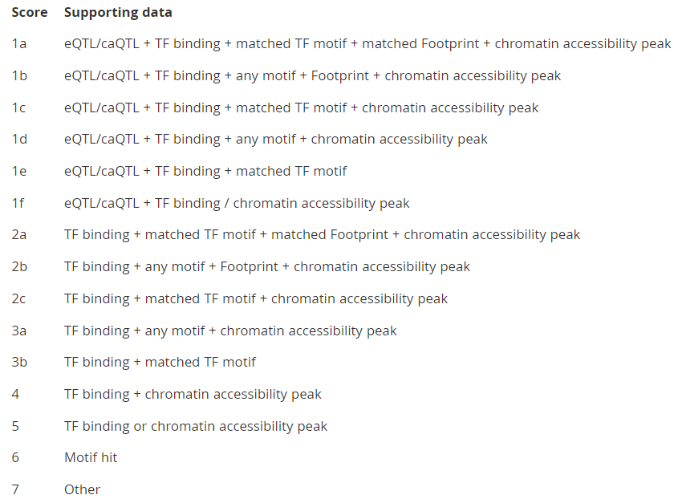{width="463"}

Our SNP has a score of 1f which indicates that there is an eQTL (more to come on this) and either TF binding or a chromatin accessibility peak there.

So, **we have good evidence that our SNP is in a regulatory region**

### ChIP data

ChIP stands for Chromatin immunoprecipitation

You can learn more here: <https://www.youtube.com/watch?v=7_-Or4ARyH0> and <https://en.wikipedia.org/wiki/Chromatin_immunoprecipitation>

The premise of ChIP is that you are able to **sequence the DNA bound to specific proteins**. You tightly bind (cross-link) DNA to Proteins and then selectively isolate the proteins (immunoprecipitation). Then sequence *only* the DNA bound to your protein. You can then generate a map of *where* your protein was bound to the genome.

Our SNP has no ChIP data but I will use a **different SNP** to demonstrate what the results would look like.

Results for SNP rs1316379

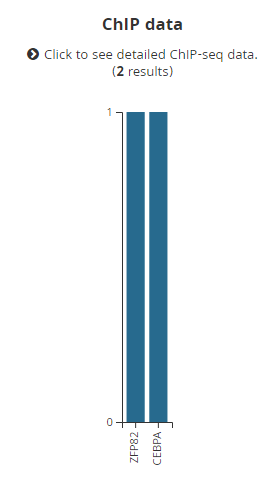{width="149"}

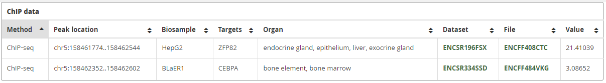

From this data we can see that two proteins ZFP82 and CEBPA are bound to our region of interest and in which organ this was detected. There is very good evidence that these two proteins can bind to our region.

### Chromatin State

DNA is not floating around our cells as double-stranded DNA. Instead DNA is highly organized into three-dimensional structures. The basic structure of DNA is the nucleosome where DNA wraps around histones (euchromatin). These histones then wrap into a fiber (heterochromatin).

When DNA is wrapped up into chromatin, it cannot be expressed. (see more here: <https://www.khanacademy.org/science/ap-biology/gene-expression-and-regulation/regulation-of-gene-expression-and-cell-specialization/v/dna-and-chromatin-regulation> )

By looking to see if our DNA if interest is exposed (not wrapped up in chromatin) we can ask if this region is transcriptionally active in particular tissues.

The chromatin state provided in regulomeDB is often the result of an analysis conducted in chromHMM ( <https://www.ncbi.nlm.nih.gov/pmc/articles/PMC3577932/> )

The various chromatin states predicted are summarized below

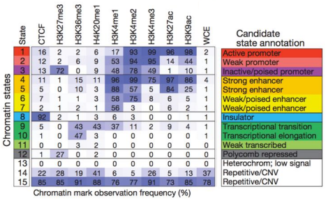

For our region the chromatin state has been found to be associated most frequently with weak transcription or active enhancer activity.

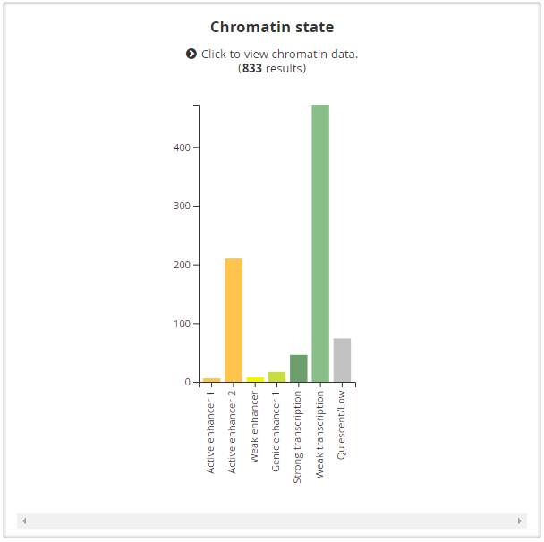{width="367"}

If you click on the chromatin state you can see a more detailed view showing which sample and organ each chromatin state was shown

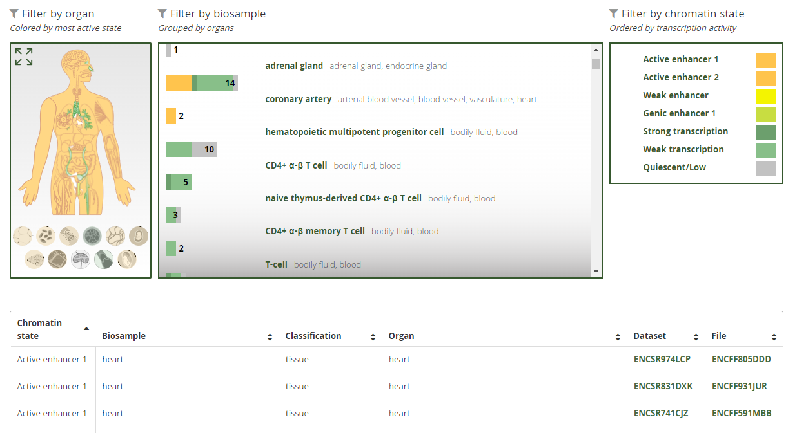

From this, we can see that this region is likely an active enhancer in the heart and coronary artery.

### Accessibility

This section displays results from chromatin accessibility experiments. Accessible chromatin is not condensed and is therefore inferred to be transcriptionally active.

DNase-seq sequences regions of the genome that are sensitive to cleavage by DNase enzyme--aka they are exposed ( <https://en.wikipedia.org/wiki/DNase_I_hypersensitive_site> )

ATAC-seq stands for **A**ssay for **T**ransposase-**A**ccessible **C**hromatin with high-throughput **seq**uencing. It also attempts to sequence transcriptionally active regions of the genome. ( <https://www.activemotif.com/blog-atac-seq> )

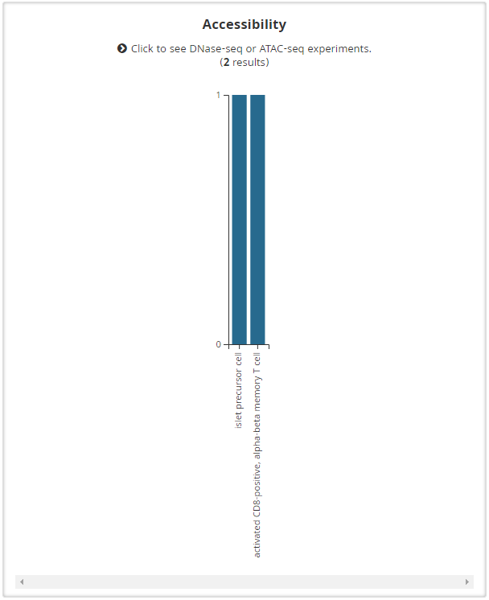{width="257"}

You can see from the summary figure our region was found to be accessible in two tissue samples through DNase-seq experiments.

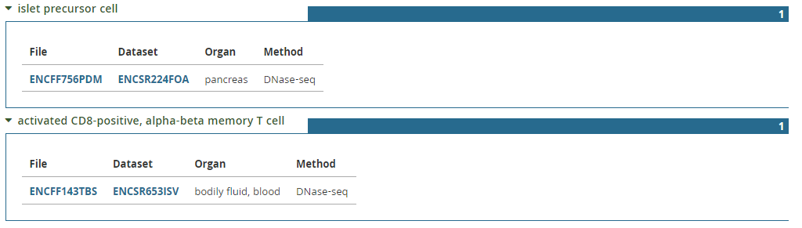

### Motifs

Transcription factors bind to specific genomic sequences known as motifs. Each position in the motif may have a different allowance for different bases. These are often determined using a consensus of known binding motifs. (more: <https://www.ebi.ac.uk/training/online/courses/human-genetic-variation-introduction/what-is-genetic-variation/variants-in-transcription-factor-binging-motifs/> )

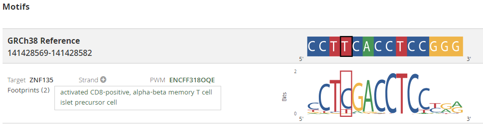

You can see that in a cell line they detected binding of ZNF135. Our SNP has the red box around it. If we recall our protective and risk allele (C = decrease risk; T = increased risk) it looks like the risk allele T may interfere with the binding of ZNF135. The consensus sequence suggests that most of the time there is a C in that position in the motif. We would need to do additional analyses to confirm if C or T has better/worse binding of the TF to the DNA.

### QTL data

QTL stands for Quantitative Trait Locus and is a region or SNP associated with a specific variable trait in the population. An eQTL is an expression-QTL that associates variation in the genome with variance in gene expression. The portal also reports caQTLs which are chromatin accessibility QTLs (read more <https://www.illumina.com/techniques/popular-applications/qtl-analysis.html> )

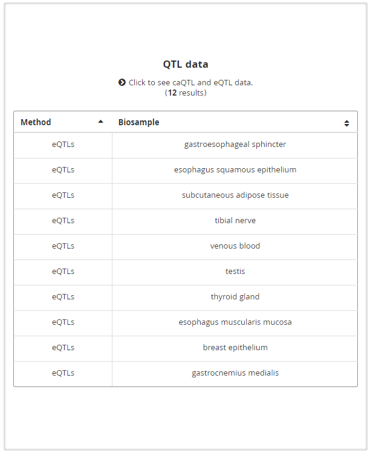{width="353"}

From the snapshot we can see that there are 12 results in this category. We are going to further explore eQTLs below. This data shows that variation at our SNP results in the differential expression of the gene ZBTB38 in multiple tissues

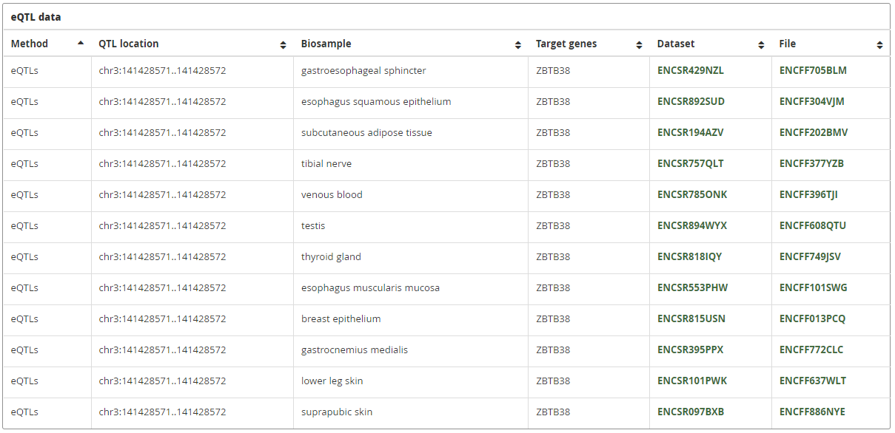{width="455"}

### Genome Browser

You **must click on the link** to see your region in the genome browser. (the snapshot is not of our region).

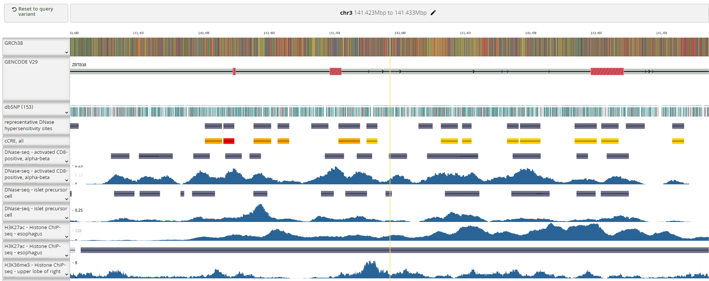

The genome browser gives us an overview of the location of our SNP (yellow line). There are over 422 tracks (data sets) that you can view on the genome browser.

### RegulomeDB summary

Our variant is most likely found in a regulatory region that regulates expression of ZBTB38. This may be through binding of the transcription factor ZNF135

## GTEx database (<https://gtexportal.org/home/>)

Developmental Genotype-Tissue Expression (dGTEx) Project is an effort to study development-specific genetic effects on gene expression. You can search for the exact SNP of interest.

Searching for **rs7650602** will bring up a Variant Page. This will have information about the variant and it's position.

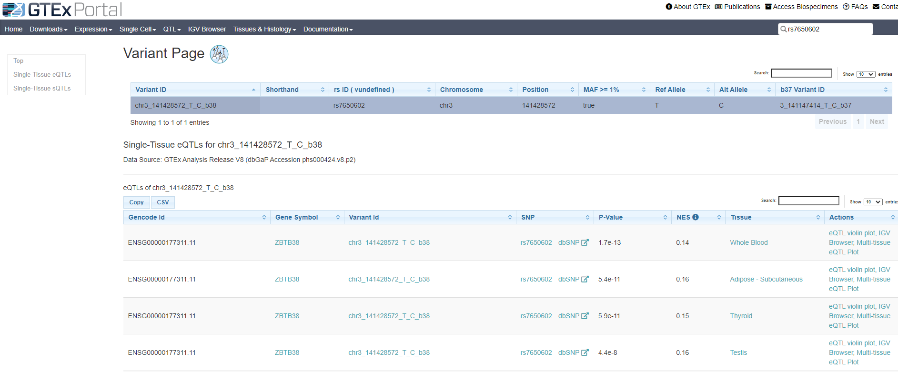

From here we can see that there is one eQTL for this locus. (note: this is the same as the results in regulomeDB. This is not always the case. The displays in GTEx are better so I like to look at them here)

**eQTL violin plot** will show us how expression changes for the associated gene.

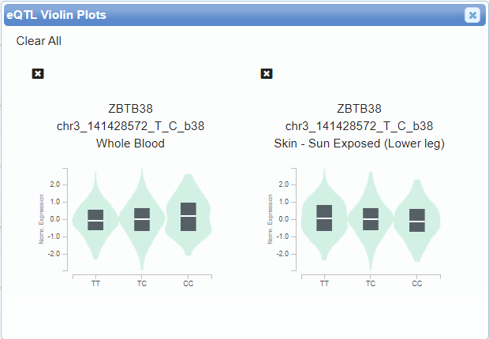{width="360"}

For each tissue you will see a plot showing the genotypes and the associated phenotypes. In whole blood we can see that being heterozygous for C (CC) there is increased expression of ZBTB38 as compared to heterozygous T (TT). In Skin (sun exposed) we see the opposite effect. Where CC is associated with lower expression of the same gene!

**GTEx IGV Browswer** This will show you a visual of the eQTLs along the genome. You can add and remove tracks.

**Multi-tissue eQTL Plot** This will show a visual of *all* the tissues that this variant is associated with.

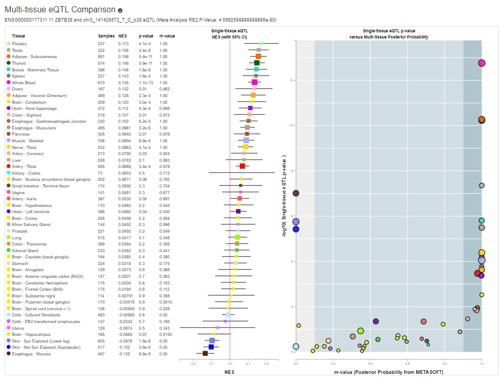

On the y-axis of the figure is the p-value. The smaller the p-value the greater the association between the expression variance and the tissue. On the y-axis is the m-value. This is "posterior probability that an eQTL effect exists in each tissue tested in the cross-tissue meta-analysis. The m-value ranges between 0 and 1"(Han & Eskin 2011 and 2012).

m-value \<0.1: Tissue is predicted to NOT have an eQTL effect

m-value \>0.9: Tissue is predicted to HAVE an eQTL effect

0.1 \<= v-value \<= 0.9: Prediction effect is ambiguous

This is why the dots all the way to the left (lowest m-value) are not reported on th previous page. The effect is not robust to additional meta-analysis.

## 4. Pleiotropic effects

### GWAS Catalog

A single gene or locus can affect many different traits. We saw in our GWAS that this SNP can affect gestational age and preterm birth.

This region may be pleiotropic, meaning that variation at this one locus influences multiple traits. We can turn to the GWAS catalog to look for other GWAS that have identified this variant. You can search the variant by it's rs **rs7650602** number on <https://www.ebi.ac.uk/gwas/>

The GWAS catalog identified 18 traits with an association with our SNP

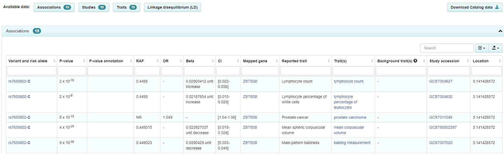

14 traits show increased risk with the C allele. These traits are broadly lymphocyte phenotypes, prostate cancer, male-pattern baldness, red blood cell count, pulmonary disease, and myopia.

3 traits show increased risk with the T allele. *However,* these three are all associated with educational attainment. This is not very helpful to our analysis as there has likely not been significant selection on educational attainment.

Interestingly, our risk allele T is the protective allele for many of these traits! This suggests that there may be trade-offs between these traits.

### PheWAS

A Phenome-wide association study (PheWAS) is essentially the opposite of a GWAS. Where researchers associated a single genomic loci with multiple phenotypes. (more: <https://en.wikipedia.org/wiki/Phenome-wide_association_study> )

This will help us associate our exact locus with other phenotypes. There are a couple of resources we can use to look at this

GWAS Atlas <https://atlas.ctglab.nl/PheWAS>

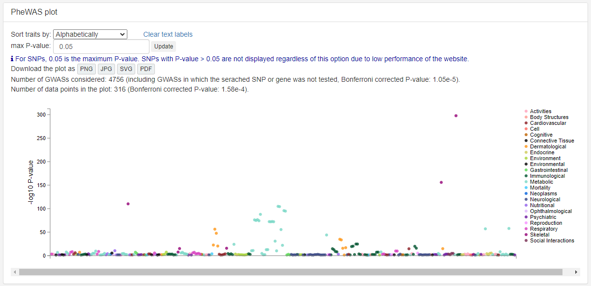

You can see that there are a lot of metabolic traits associated with variation at this position. The two highest points on the right (purple) are both associated with height. From the PheWAS table you can see that the effect allele (EA) is C in many of the traits associated with height and size. This suggests that the protective allele C (for our trait PTB) is associated with increased height and mass.

*Side note: This may not seem intuitive. This suggests that people who were bigger babies are less likely to have a preterm birth. This was discussed in the original manuscript we looked at which discusses the complex relationship between **fetal** (not maternal) genes that increase fetal weight.*

## 5. Conservation

One of the strongest signatures of different evolutionary histories is the presence (or absence) of conservation in a region.

### Derived versus Ancestral allele

First we will try to uncover which allele is older (ancestral) and which allele is newer (derived). This data can be found easily in the Ensembl database (<https://useast.ensembl.org/Homo_sapiens>)

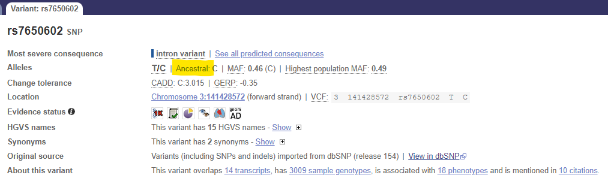

For our snp **rs7650602** the ancestral (older) allele is C. This means that the derived (newer) allele is T

### How old is the allele?

#### Across mammals or vertebrates

If the C allele is older, how long ago was the T allele introduced to humans? By looking at conservation across different groups of species we can try to determine if the derived allele existed prior to speciation.

We can look at this conservation in Ensembl or in the UCSC genome browswer. For this case I'll use Ensembl.

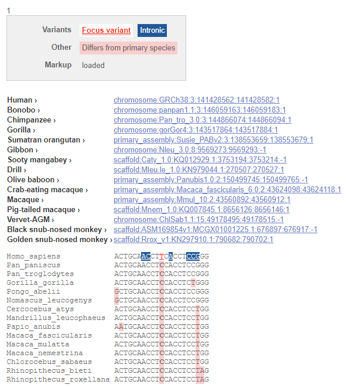{width="405"}

Our region of interest is in the Red T. You can see that at this position *all* the other species that have DNA that will align to this region have a C. This suggests that the C is highly conserved and old!

*Side note: The genomes on genome browsers are reference genomes. We know very little about the genomic diversity of most species. So having a C in one position doesn't necessarily mean that no gorillas have a T. However, if T and C were both common across all the species we would expect that some of them would have T and some would have a C.*

#### Across great apes

As a part of the Great Ape Genome Project ( <https://eichlerlab.gs.washington.edu/greatape/> ) multiple Great Ape genomes were sequenced. Great Apes are our closest living non-human relatives. Using this data we can confirm (or refute) the hypothesis that great apes do not have a T at this position.

The Great Ape Files are in our labella_lab project space and are VCF Files. Importantly, the positions are **hg18** which is an old version of the human genome. Moreover, the VCF file **does not contain rs numbers**. Therefore we will need to find the position of our variant in hg18.

To find the variant in hg18 we will use an archive version of Ensembl BioMart. <http://may2009.archive.ensembl.org/index.html>

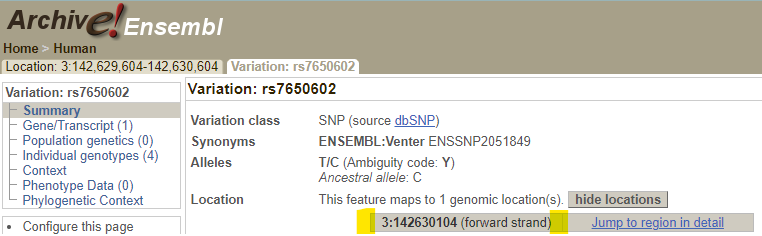{width="346"}

When we search for **rs7650602** we see it is at this position in hg18 3:142630104

We can then search the VCF files for this position (all the great ape genomes are labeled in reference to hg18). To do this we use vcftools (<https://vcftools.sourceforge.net/man_latest.html>) which is already installed on the HPC

```         
ml vcftools

 vcftools --gzvcf Pongo_pygmaeus.vcf.gz --chr chr3 --from-bp 142630104 --to-bp 142630104 --recode --out rs7650602.Pongo_pygmaeus.vcf.gz
```

**NOTE:** Originally I had `–chr 3` but it requires `–chr chr3` . This is because there is no requirement for the format of the chromosome in the VCF file. Therefore you should double check what the VCF file uses if you are getting strange results.

We found the site! Now let's get that for all the genomes

```         
VCFtools - 0.1.16
(C) Adam Auton and Anthony Marcketta 2009

Parameters as interpreted:
        --gzvcf Pongo_pygmaeus.vcf.gz
        --chr chr3
        --to-bp 142630104
        --out rs7650602.Pongo_pygmaeus.vcf.gz
        --recode
        --from-bp 142630104

Using zlib version: 1.2.11
Warning: Expected at least 2 parts in FORMAT entry: ID=PL,Number=G,Type=Integer,Description="Normalized, Phred-scaled likelihoods for genotypes as defined in the VCF specification">
Warning: Expected at least 2 parts in INFO entry: ID=AC,Number=A,Type=Integer,Description="Allele count in genotypes, for each ALT allele, in the same order as listed">
Warning: Expected at least 2 parts in INFO entry: ID=AC,Number=A,Type=Integer,Description="Allele count in genotypes, for each ALT allele, in the same order as listed">
Warning: Expected at least 2 parts in INFO entry: ID=AF,Number=A,Type=Float,Description="Allele Frequency, for each ALT allele, in the same order as listed">
Warning: Expected at least 2 parts in INFO entry: ID=AF,Number=A,Type=Float,Description="Allele Frequency, for each ALT allele, in the same order as listed">
After filtering, kept 5 out of 5 Individuals
Outputting VCF file...
After filtering, kept 1 out of a possible 78877390 Sites
Run Time = 163.00 seconds
```

When we look in the VCF files generated by our analysis we will see a line that looks like this

```         
#CHROM  POS ID  REF ALT QUAL    FILTER  INFO    FORMAT  Gorilla_beringei_graueri-9732_Mkubwa    Gorilla_beringei_graueri-A929_Kaisi Gorilla_beringei_graueri-Victoria   Gorilla_gorilla_dielhi-B646_Nyango  Gorilla_gorilla_gorilla-9749_Kowali Gorilla_gorilla_gorilla-9750_Azizi  Gorilla_gorilla_gorilla-9751_Bulera Gorilla_gorilla_gorilla-9752_Suzie  Gorilla_gorilla_gorilla-9753_Kokomo Gorilla_gorilla_gorilla-A930_Sandra Gorilla_gorilla_gorilla-A931_Banjo  Gorilla_gorilla_gorilla-A932_Mimi   Gorilla_gorilla_gorilla-A933_Dian   Gorilla_gorilla_gorilla-A934_Delphi Gorilla_gorilla_gorilla-A936_Coco   Gorilla_gorilla_gorilla-A937_Kolo   Gorilla_gorilla_gorilla-A962_Amani  Gorilla_gorilla_gorilla-B642_Akiba_Beri Gorilla_gorilla_gorilla-B643_Choomba    Gorilla_gorilla_gorilla-B644_Paki   Gorilla_gorilla_gorilla-B647_Anthal Gorilla_gorilla_gorilla-B650_Katie  Gorilla_gorilla_gorilla-KB3782_Vila Gorilla_gorilla_gorilla-KB3784_Dolly    Gorilla_gorilla_gorilla-KB4986_Katie    Gorilla_gorilla_gorilla-KB5792_Carolyn  Gorilla_gorilla_gorilla-KB5852_Helen    Gorilla_gorilla_gorilla-KB6039_Oko  Gorilla_gorilla_gorilla-KB7973_Porta    Gorilla_gorilla_gorilla-X00108_Abe  Gorilla_gorilla_gorilla-X00109_Tzambo
chr3    142630104   .   T   C   15866.3 PASS    .   GT:ABP:AD:DP:GQ:PL  1/1:10.40:0,15:15:42.09:484,42,0    1/1:13.86:0,20:20:57.16:683,57,0    1/1:11.78:0,17:17:51.12:591,51,0    1/1:6.93:0,10:10:24.06:266,24,0 1/1:6.93:0,10:10:27.07:306,27,0 1/1:3.47:0,5:5:15.04:179,15,0   1/1:7.62:0,11:11:24.07:272,24,0 1/1:4.85:0,7:7:21.02:222,21,0   1/1:3.47:0,5:5:15.05:187,15,0   1/1:8.32:0,12:12:36.09:420,36,0 1/1:6.93:0,10:10:30.09:356,30,0 1/1:13.17:0,19:19:57.15:643,57,0    1/1:14.56:0,21:21:63.18:754,63,0    1/1:8.32:0,12:12:36.07:400,36,0 1/1:15.25:0,22:22:63.16:705,63,0    1/1:12.48:0,18:18:54.13:621,54,0    1/1:12.48:0,18:18:45.12:533,45,0    1/1:6.24:0,9:9:21.03:231,21,0   1/1:10.40:0,15:15:45.12:525,45,0    1/1:6.93:0,10:10:30.08:328,30,0 1/1:10.40:0,15:15:45.1:527,45,0 1/1:9.70:0,14:14:36.04:380,36,0 1/1:2.77:0,4:4:12.03:140,12,0   1/1:10.40:0,15:15:45.13:514,45,0    1/1:7.62:0,11:11:33.07:361,33,0 1/1:2.77:0,4:4:12.04:143,12,0   1/1:15.25:0,22:22:66.19:768,66,0    1/1:8.32:0,12:12:36.06:403,36,0 1/1:6.24:0,9:9:27.08:330,27,0   1/1:9.01:0,13:13:36.11:437,36,0 1/1:12.48:0,18:18:54.12:613,54,0
```

In the first nine columns we see information about our region. We can see that the REF(erence) allele is T and the ALT(ernate) allele is C. The reference allele will be encoded by a 0. The alternative allele will be encoded by a 1.

Let's look at the data for one gorilla Gorilla_beringei_graueri-9732_Mkubwa

`1/1:10.40:0,15:15:42.09:484,42,0`

In the FORMAT column we can see that this data encodes `GT:ABP:AD:DP:GQ:PL`

In the header of our data we can see what those abbreviations stand for

```         
##FORMAT=<ID=ABP,Number=1,Type=Float,Description="-logBase10(pbinom(AlleleBalance))">
##FORMAT=<ID=AD,Number=.,Type=Integer,Description="Allelic depths for the ref and alt alleles in the order listed">
##FORMAT=<ID=DP,Number=1,Type=Integer,Description="Read Depth (only filtered reads used for calling)">
##FORMAT=<ID=GQ,Number=1,Type=Float,Description="Genotype Quality">
##FORMAT=<ID=GT,Number=1,Type=String,Description="Genotype">
##FORMAT=<ID=PL,Number=G,Type=Integer,Description="Normalized, Phred-scaled likelihoods for genotypes as defined in the VCF specification">
```

We are most interested in the first value--the Genotype.

In our sample Gorilla Mkubwa we see that their genotype is 1/1 or C/C

|                                         |     |
|-----------------------------------------|-----|
| Gorilla_beringei_graueri-9732_Mkubwa    | 1/1 |
| Gorilla_beringei_graueri-A929_Kaisi     | 1/1 |
| Gorilla_beringei_graueri-Victoria       | 1/1 |
| Gorilla_gorilla_dielhi-B646_Nyango      | 1/1 |
| Gorilla_gorilla_gorilla-9749_Kowali     | 1/1 |
| Gorilla_gorilla_gorilla-9750_Azizi      | 1/1 |
| Gorilla_gorilla_gorilla-9751_Bulera     | 1/1 |
| Gorilla_gorilla_gorilla-9752_Suzie      | 1/1 |
| Gorilla_gorilla_gorilla-9753_Kokomo     | 1/1 |
| Gorilla_gorilla_gorilla-A930_Sandra     | 1/1 |
| Gorilla_gorilla_gorilla-A931_Banjo      | 1/1 |
| Gorilla_gorilla_gorilla-A932_Mimi       | 1/1 |
| Gorilla_gorilla_gorilla-A933_Dian       | 1/1 |
| Gorilla_gorilla_gorilla-A934_Delphi     | 1/1 |
| Gorilla_gorilla_gorilla-A936_Coco       | 1/1 |
| Gorilla_gorilla_gorilla-A937_Kolo       | 1/1 |
| Gorilla_gorilla_gorilla-A962_Amani      | 1/1 |
| Gorilla_gorilla_gorilla-B642_Akiba_Beri | 1/1 |
| Gorilla_gorilla_gorilla-B643_Choomba    | 1/1 |
| Gorilla_gorilla_gorilla-B644_Paki       | 1/1 |
| Gorilla_gorilla_gorilla-B647_Anthal     | 1/1 |
| Gorilla_gorilla_gorilla-B650_Katie      | 1/1 |
| Gorilla_gorilla_gorilla-KB3782_Vila     | 1/1 |
| Gorilla_gorilla_gorilla-KB3784_Dolly    | 1/1 |
| Gorilla_gorilla_gorilla-KB4986_Katie    | 1/1 |
| Gorilla_gorilla_gorilla-KB5792_Carolyn  | 1/1 |
| Gorilla_gorilla_gorilla-KB5852_Helen    | 1/1 |
| Gorilla_gorilla_gorilla-KB6039_Oko      | 1/1 |
| Gorilla_gorilla_gorilla-KB7973_Porta    | 1/1 |
| Gorilla_gorilla_gorilla-X00108_Abe      | 1/1 |
| Gorilla_gorilla_gorilla-X00109_Tzambo   | 1/1 |

In fact, none of the gorillas that were sequenced have a T!

Here is a summary of the rest of the Great Ape sequences

| Species                 | 1/1 Genotype | 0/1 Genotype | 0/0 Genotype |
|-------------------------|--------------|--------------|--------------|
| Gorilla_gorilla_gorilla | 31           | 0            | 0            |
| Pongo_pygmaeus          | 5            | 0            | 0            |
| Pongo_abelii            | 5            | 0            | 0            |
| Pan_troglodytes         | 25           | 0            | 0            |
| Pan_paniscus            | 13           | 0            | 0            |

Not a single Great Ape sample contained the T allele! This suggests that it is not present in the Great Apes (at least not at a high frequency)

#### Ancient Human DNA

Recently, we have been able to look at our evolutionary history after our split from the great apes but before modern humans by analyzing ancient human DNA from Neanderthals and Denisovans.

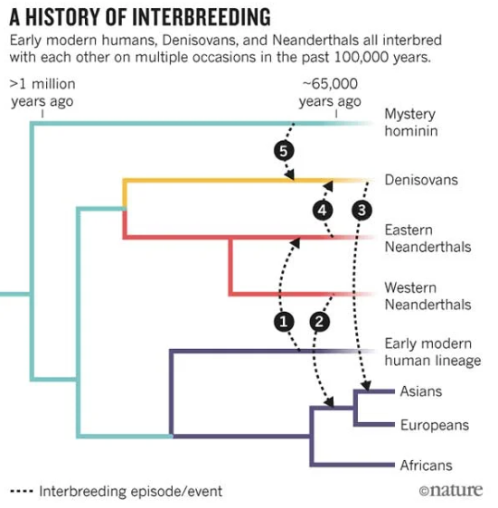{width="349"}

This figure from nature shows interbreeding between the various lineages of early modern humans.

There are new ancient human genomes being sequenced all the time. But the easiest way to look for ancient human variation is on the UCSC Genome browser for GRCh37/hg19

To visualize the Neandert(h)al and Denisovan assemblies set the following tracks to full and then hit refersh

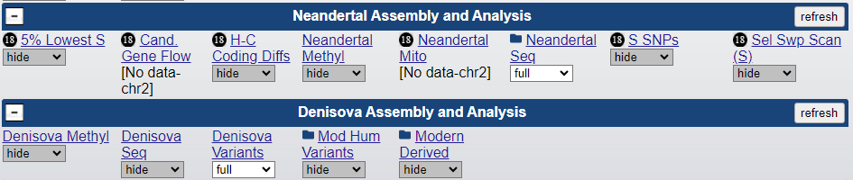

We can then search for our variant and zoom in on the reads from ancient humans

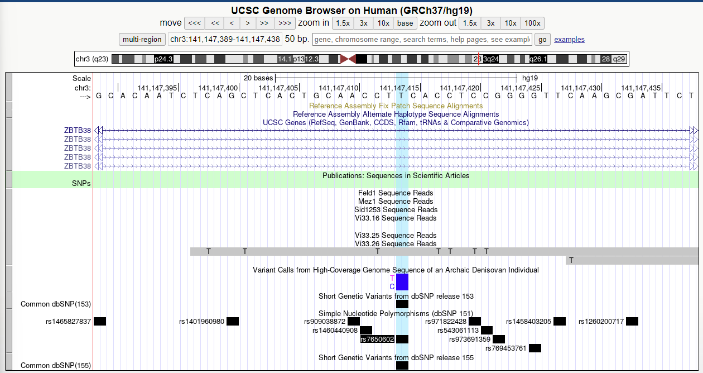

And we see that in the track "Variant Calls from High-Coverage Genome Sequence of an Archiac Denisovan Individual" has a sequence at this position. So let's click on the blue box and see what the data shows

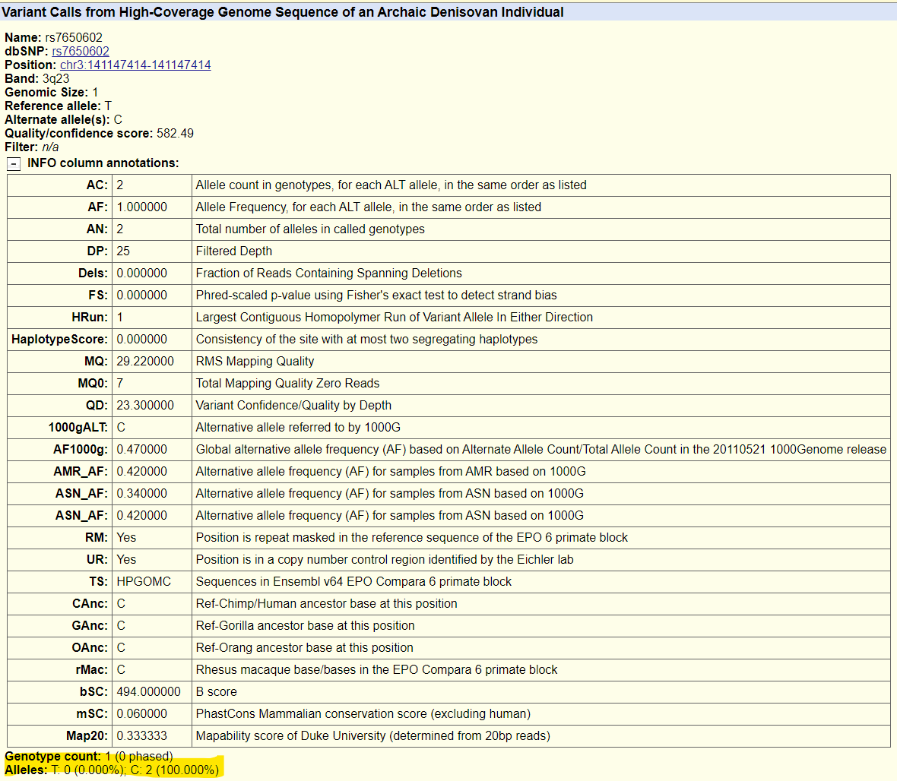

From this we can see that 100% of the Denisovan samples were C. This *suggests* that the T variant was not present in ancient humans.

Recently there was a new resource released "A curated data set of modern and ancient high-coverage shotgun human genomes" <https://www.nature.com/articles/s41597-021-00980-1>

This is in a VCF data_paper_16sgdp_19ancient_120521.vcf.gz

We will filter this using vcftools. The manuscript indicated that the sequences were aligned to hg19 so we will be looking for position 3:141147414

Unfortunately, this dataset did not contain our position of interest.

# 6. Modern Human Variation

Many modern humans have now been sequenced either at the whole-genome level or just for common human variants. We can use this data to ask questions about the fequency and haplotype structure of the region of interest.
